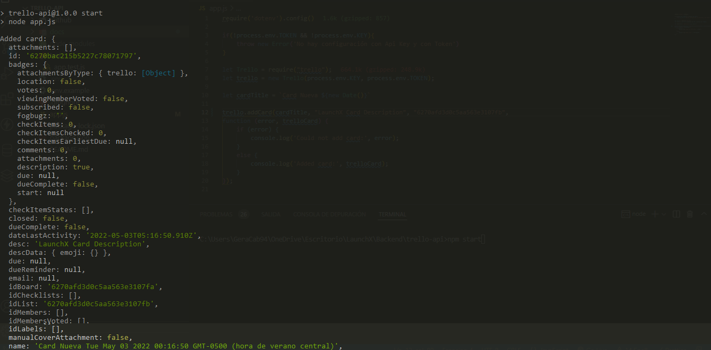
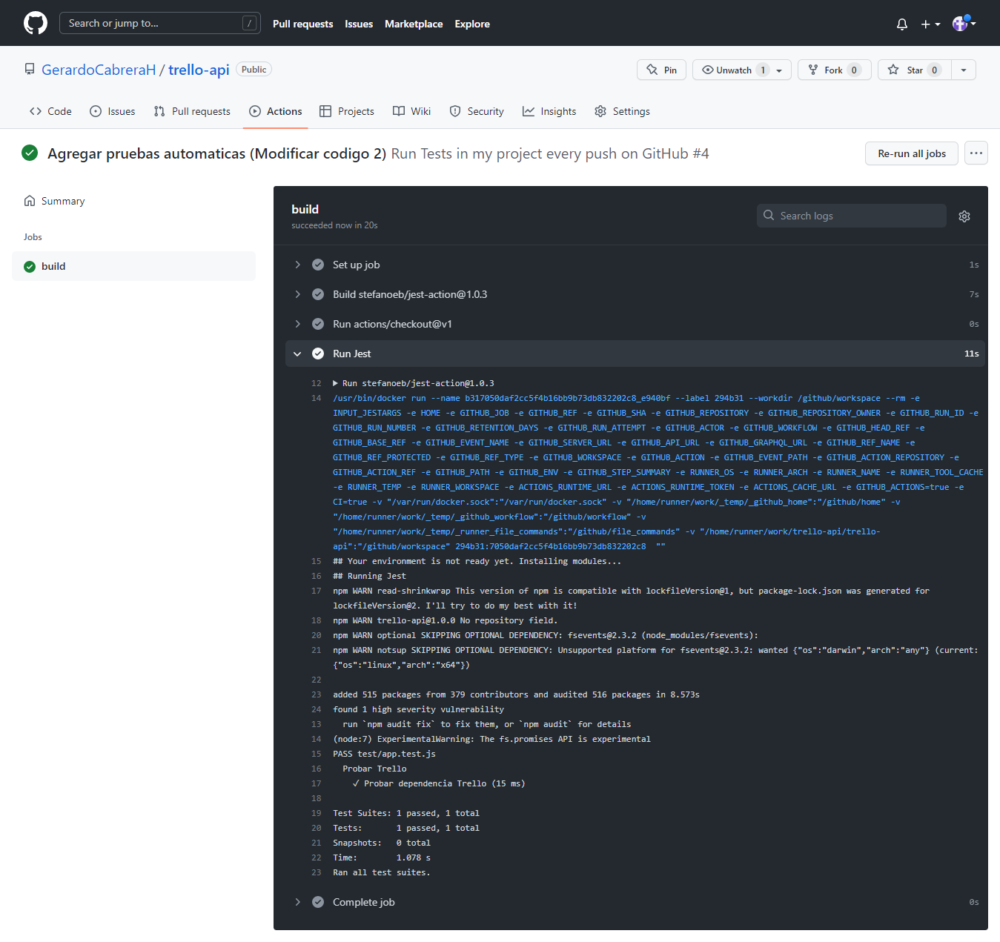
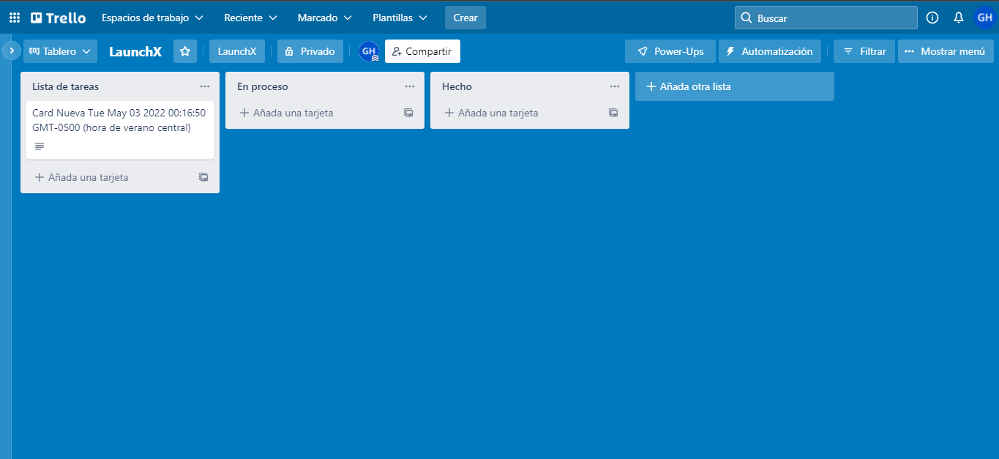

# Trello API

## Dependencias

1. Trello: Dependencia que consume a la API de Trello.
2. Dotenv: Conecta las variables de entorno `.env` a la aplicación NodeJS
3. Jest: Framework de pruebas de código.
4. esLinter: Dar formato al código.

## Descripción

Codigo hecho en CommonJS y su archivo principal se encuentra en `app.js`. Lo primero que se debe de hacer es descargar la Dependencia `Trello` para poder conectar con la API sin consumirla con dependencias Fetch. Lo único que se necesita los identificadores que se conecta con la API:

## Archivo `app.js`

1. KEY
2. TOKEN

Para eso se necesita un archivo que guarde las variables para usarlas en el entorno, se guardaran en `.env` y ese archivo no se sube al repositorio en Github, pero si se crea uno como ejemplo que se llama `.env.example` y se guarda con las variables vaciás para que el desarrollador pueda poner sus credenciales de Trello, esas credenciales se necesita conectarse con la dependencia `dotenv` al proyecto. Ya definidas las credenciales se crea el archivo `app.js` con las variables de entorno y la configuración para conectarse con Trello.

```
require('dotenv').config()

if(!process.env.TOKEN && !process.env.KEY){
    throw new Error('No hay configuración con Api Key y con Token')
}

let Trello = require("trello");
let trello = new Trello(process.env.KEY, process.env.TOKEN);

let cardTitle = `Card Nueva ${new Date()}`

trello.addCard(cardTitle, "LaunchX Card Description", "6270afd3d0c5aa563e3107fb",
function (error, trelloCard) {
    if (error) {
        console.log('Could not add card:', error);
    }
    else {
        console.log('Added card:', trelloCard);
    }
});

```

## Pruebas `app.test.js`

Despues se crea las pruebas basadas en el código para ver si se crea una nueva **card** cuando se consume la api de Trello. El archivo se guarda en la carpeta `test` con el nombre `app.test.js`.

```
require("dotenv").config();

const Trello = require("trello");

const trello = new Trello(process.env.KEY, process.env.TOKEN);

describe("Probar Trello", () => { 
    test("Probar dependencia Trello", () => {
        const cardTitle = `Card Nueva ${new Date()}`;
        trello.addCard(cardTitle, "LaunchX Card Description", "627014b6b6da99245b02e677",
        function (error, trelloCard) {
            if (error) {
                expect(error).toBe(error);
            }
            else {
                expect(trelloCard.desc).toBe("LaunchX Card Description");
            }
            }
        );
    });
});
```

## Github Actions

Después se le da formato al código mediante `esLinter` y luego se crea la configuración de las pruebas automáticas en **Github Actions** con el nombre de archivo `test.yml` que se guarda en `workflows` dentro de la carpeta `.github`.

## Resultados

Crear card corriendo la aplicación.


Pruebas en Github Action


Pagina de trello


